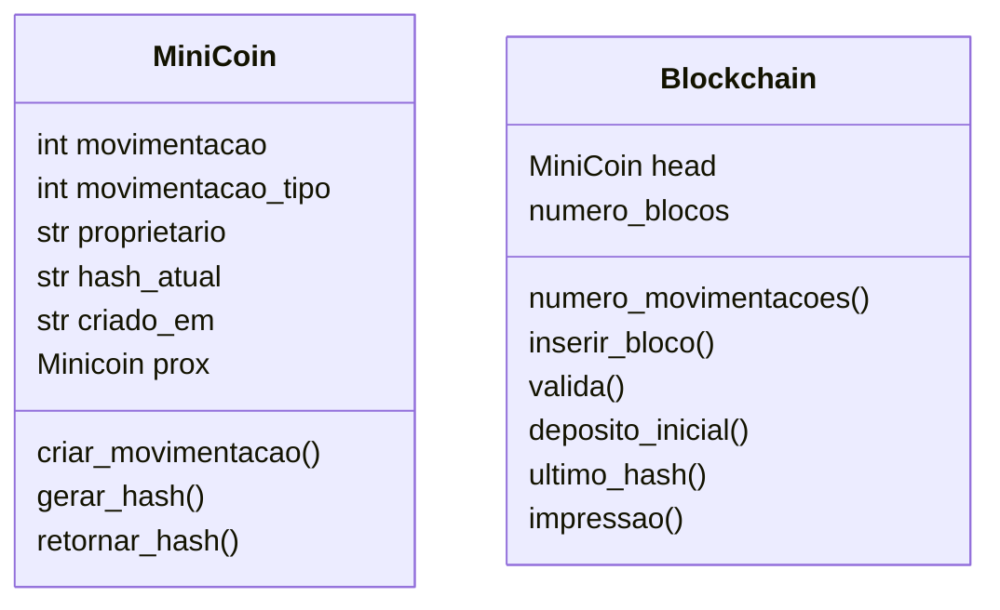
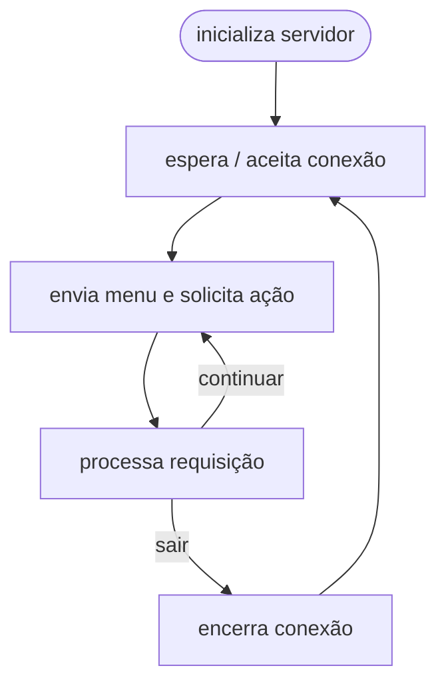
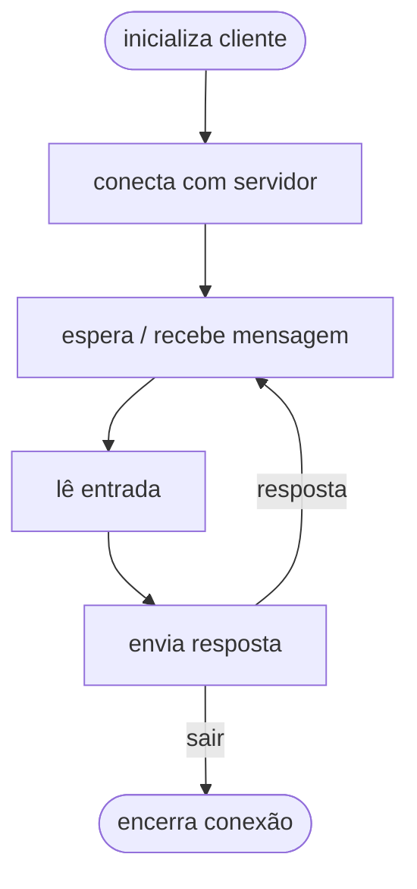

# MiniCoins 💰


|Nome das Alunas:| GRR |  
|-------------------------------|------  
| Giovanna Fioravante Dalledone |  20232370
| Nadia Luana Lobkov            |  20232381  

**Linguagem Escolhida: Pyhton** 🐍  

## Sumário
1. Início da implementação
2. Cliente-Servidor
3. Chamadas Entre Cliente-Servidor e Blockchain
4. Execução

## Arquivos

---

## 1. Início da Implementação 🌐
Após a escolha da linguagem, foi dado início ao desenvolvimento do trabalho que se deu pela implementação da lista ligada - base da blockchain - e da estrutura cliente-servidor. Enquanto isso, foi possível pesquisar e entender mais sobre a definição de `blockchains` e como utilizar o `hash`.


O desenvolvimento do trabalho teve por início a implementação da lista ligada que representa a Blockchain. Para isso, foram definidas duas classes: `MiniCoins` e `blockchain`.


<style>
.mermaid-wrapper { margin: 24px 40px; }
</style>


<div class="mermaid-wrapper">


</div>

A classe `MiniCoins` tem os métodos que manipulam as movimentações financeiras, enquanto isso, a classe `blockchain` tem os métodos que tratam a lista.

Dado o contexto de uma blockchain, não havia sentido em implementar uma função de `remover_bloco`, pois o objetivo da lista é manter um registro de todas as movimentações do usuário.

A primeira organização do código foi guardar as classes mencionadas em um primeiro arquivo chamado `lista.py`, porém, depois de conversas, foi chego à conclusão de que seria melhor isolar as classes em arquivos separados, sem a necessidade de uma pasta.

### Pequenos Problemas de Implementação
Durante os testes, alguns problemas de implementação surgiram:
1. O Depósito Inicial era alterado a cada movimentação. A solução foi criar um método na classe `Blockchain` chamado `deposito_inicial` que retorna o depósito inicial registrado na primeira operação. 
2. A validação utilizando as funções `hash` não funcionava. O problema era extremamente simples, o código não armazenava o retorno do cálculo do hash.

## 2. Cliente-Servidor

Para simular o banco usamos um sistema cliente-servidor usando a biblioteca `socket` em Python. Foi criada uma classe auxiliar `Banco` responsável pelas mensagens trocadas na interação, são diversos métodos que retornam mensagens (strings) que o cliente vai receber do servidor, como o banner do banco, instrução para a criação da conta, menu de opções e mensagens de controle do servidor contendo as ações realizadas pelo cliente.

### Fluxo Servidor

O programa `servidor.py` funciona da seguinte maneira:

1. O servidor cria o socket, inicia o banco e entra em um loop para ficar na escuta/espera de conexões.
2. Uma vez que o cliente se conecta, o servidor envia o menu de opções de ações para o cliente.
3. Ao receber a resposta do cliente, ele excecuta o que foi pedido (chamando os métodos da classe `Blockchain`) e exibe novamente o menu até o cliente sair.

<div class="mermaid-wrapper">


</div>

*Durante esse processo, são impressas mensagens de controle no servidor que informam as ações do cliente.*
   
### Fluxo Cliente

O programa `cliente.py` funciona da seguinte maneira:

1. O cliente cria o socket e se conecta no servidor.
2. Uma vez conectado, ele espera uma mensagem do servidor.
3. Ele verifica de a mensagem é válida (se não é uma de encerramento) e espera o usuário digitar uma entrada como resposta.
4. Ele envia essa resposta ao servidor e volta a esperar um retorno do servidor.

<div class="mermaid-wrapper">


</div>

*Todas as mensagens recebidas são impressas para o usuário poder tomar alguma ação.*

### Pequenos Problemas Durante a Implementação

Durante a implementação dos programas Cliente e Servidor enfrentamos alguns pequenos desafios:

1. **Dependência do servidor com o cliente:** depois da execução dos programas, **ao encerrar o cliente, o servidor também era encerrado.** Isso aconteceu pois a função `listen()` estava fora do laço, então ao encerrar o cliente, o servidor perdia a conexão e não voltava a ouvir/esperar por novas conexões.

2. **Saída do cliente:** quando o cliente decidia sair do banco, **o banco enviava a mensagem de saida mas o cliente não saia.** Isso acontecia pois, da maneira que o cliente foi implementado, ao receber uma mensagem ele sempre lê um *input* para enviar ao servidor. Então, quando o servidor enviava um "adeus" ao cliente, o cliente ficava esperando um input e não encerrava a conexão. A forma encontrada para contornar esse problema (sem atrapalhar o fluxo proposto) foi adicionar uma condição: se ele recebesse a mensagem de despedida, então ele encerra.

## 3. Chamadas Cliente-Servidor-Blockchain

Implementar a "conversa" entre o cliente e o servidor foi uma tarefa mais simples do que o esperado.  
Nesse contexto, o servidor - além de enviar as opções ao cliente - mantém a blockchain e é nele que as funções são chamadas. Um detalhe a ressaltar é que o saldo da conta do usuário não é guardado na estrutura, mas sim calculado ao percorrer toda a blockchain quando o método é chamado. 

### 3.1 Mensagens de Log

Todas as ações do servidor, bem como as escolhas do cliente, são documentadas nos arquivos `servidor.log`e `cliente.log`. As mensagens são geradas pela biblioteca `logging`, presente tanto em `servidor.py` quanto `cliente.py`. Os logs registram as informações de conexão e também uma representação da blockchain. Infelizmente, ao visualizar os arquivos logs em `.txt`, não é possivel ver os emojis que usamos para uma visualização mais divertida. Aqui esta um exemplo de um recorte do log do servidor:

```log
2025-11-13 21:30:10,662 - INFO - Escolha do cliente james: 3
2025-11-13 21:30:12,374 - INFO - Confirmação de saque enviada ao cliente james.
2025-11-13 21:30:12,374 - INFO - Estado atual da blockchain impresso no servidor:
 ⛁ == ⛁ == ⛁ == ⛁ == BLOCKCHAIN == ⛁ == ⛁ == ⛁ == ⛁

⛀-⛀-⛀-⛀-⛀-⛀-⛀-⛀- BLOCO 1 -⛀-⛀-⛀-⛀-⛀-⛀-⛀-⛀
| Proprietário: james
| Movimentação: 0
| Depósito Inicial: 100
| Tipo da Movimentação: Primeiro Depósito
| Criado em: 2025-11-13T21:29:53.998306
| Hash Atual: d8420622bd2d8f83ce9ed7570be571f531c4adcf7ba7a0936187c052c9c3b387
⛀-⛀-⛀-⛀-⛀-⛀-⛀-⛀-⛀-⛀-⛀-⛀-⛀-⛀-⛀-⛀-⛀-⛀-⛀-⛀-⛀
                    |
                    |
⛀-⛀-⛀-⛀-⛀-⛀-⛀-⛀- BLOCO 2 -⛀-⛀-⛀-⛀-⛀-⛀-⛀-⛀
| Proprietário: james
| Movimentação: -73
| Depósito Inicial: 100
| Tipo da Movimentação: Saque
| Criado em: 2025-11-13T21:30:04.726579
| Hash Atual: 6daaeb0d873e955d093387fbd9800b05d26316a050b9871ee4505fc3902d0d1d
⛀-⛀-⛀-⛀-⛀-⛀-⛀-⛀-⛀-⛀-⛀-⛀-⛀-⛀-⛀-⛀-⛀-⛀-⛀-⛀-⛀
                    |
                    |
⛀-⛀-⛀-⛀-⛀-⛀-⛀-⛀- BLOCO 3 -⛀-⛀-⛀-⛀-⛀-⛀-⛀-⛀
| Proprietário: james
| Movimentação: -20
| Depósito Inicial: 100
| Tipo da Movimentação: Saque
| Criado em: 2025-11-13T21:30:12.374651
| Hash Atual: 10ce0db11bbff69caaceab226dea811b8ae0a8a1be8ca9f597faacbd13f79af0
⛀-⛀-⛀-⛀-⛀-⛀-⛀-⛀-⛀-⛀-⛀-⛀-⛀-⛀-⛀-⛀-⛀-⛀-⛀-⛀-⛀

💰 Saldo Atual: 7 Minicoins

⛁ == ⛁ == ⛁ == ⛁ == ⛁ == ⛁ == ⛁ == ⛁ == ⛁ == ⛁ == ⛁
```

### Pequenos Probelmas Durante a Implementação
Alguns problemas foram enfrentados durante essa etapa, a maioria deles foi consequência de desatenção com os nomes das variáveis e com os atributos das classes.
1. **Cálculo do saldo**: O cálculo do saldo sempre retornava o mesmo valor do depósito inicial. Isso acontecia porque na linha de incrementar o saldo, a variável estava errada. Era para acumular "saldo + movimentação" e o que estava escrito era `saldo += saldo`.
2. **Uma confusão**: Antes de chamar as funções da blockchain no servidor, foi um pouco confuso entender como a linguagem Python lida com a arquitetura cliente-servidor. Era suspeitosamente simples. Depois de entendido, foi bem simples o funcionamento.
3. **Valores Inesperados:** Ao inserir **valores negativos** na entrada, o programa fazia uma operação inversa por conta do sinal. Então se era feito um depósito de MiniCoins negativas, ele perdia moedas e se ele fazia um saque de MiniCoins negativas, ele ganhava moedas. Para resolver isso, bastou adicionar uma condição verificando a entrada do cliente.

## 4. Execução 🤖

Para executar o programa, é preciso ter o endereço IP do servidor e a porta. Executamos assim:

``` bash
python3 servidor.py <ip_servidor> <porta>
```
```bash
python3 cliente.py <ip_servidor> <porta>
```

**Importante**: É preciso garantir que o computador tenha instalado uma versão superior ou igual a 3.7 do python ou, pelo menos, que tenha a biblioteca `dataclasses` instalada. Por garantia, executar `pip install dataclasses`.